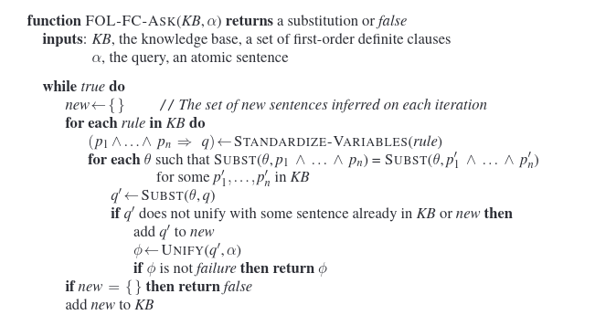
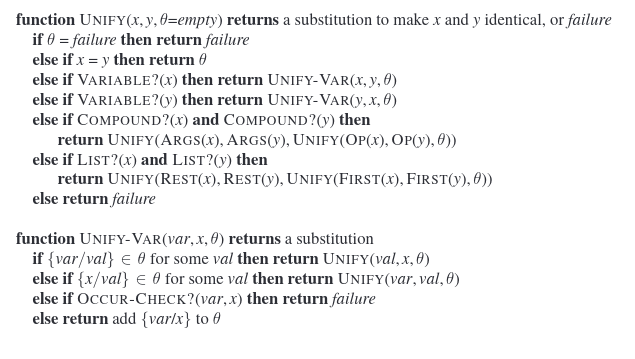

### HOW-TO

To run in your shell:  `python3 predikaty.py rules.tx`

### Implementation details

The implementation tries to implement forward chaining and unification from the AIMA book.

Algorithm is based on modification of the following algorithm from the book:

In the algorithm on the image it only gives values that satisfy certain sentence, while in our case we have to continue to gather new facts until there are no new facts possible.

The unification algorithm is straightforward because of the task simplification. 

The complete unification algorithm looks like:

Implementation is simplification of this algorithm.

### Additional notes

- explanation comments (docstrings) were added to the different parts of code, including code related to the task itself.
- some test cases from the testing web are in the `test_rules` directory with solutions
