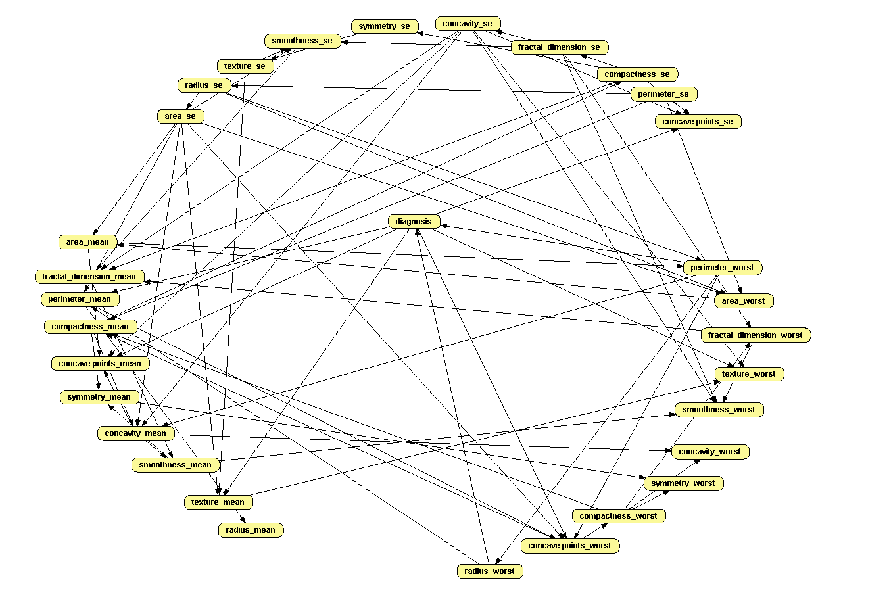
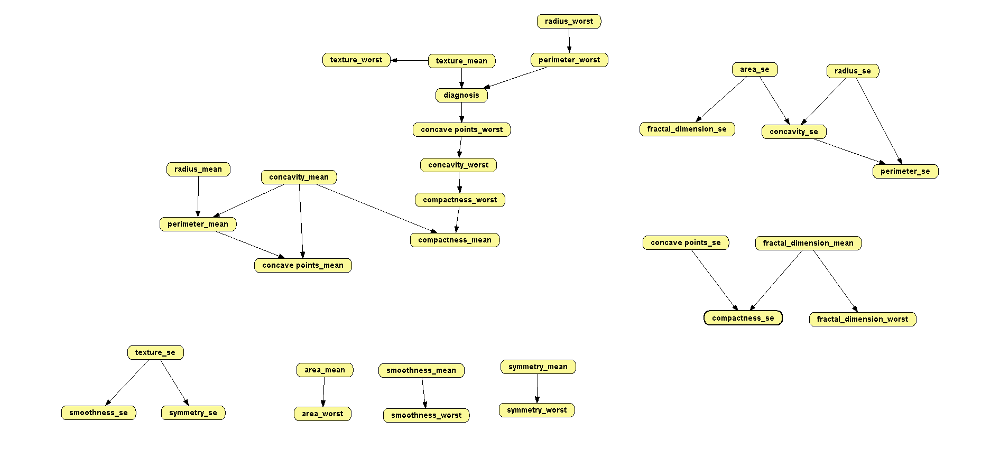
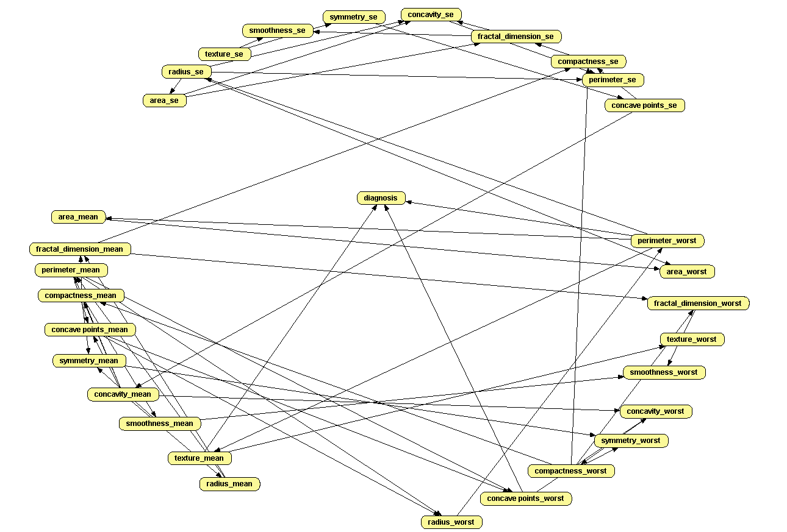
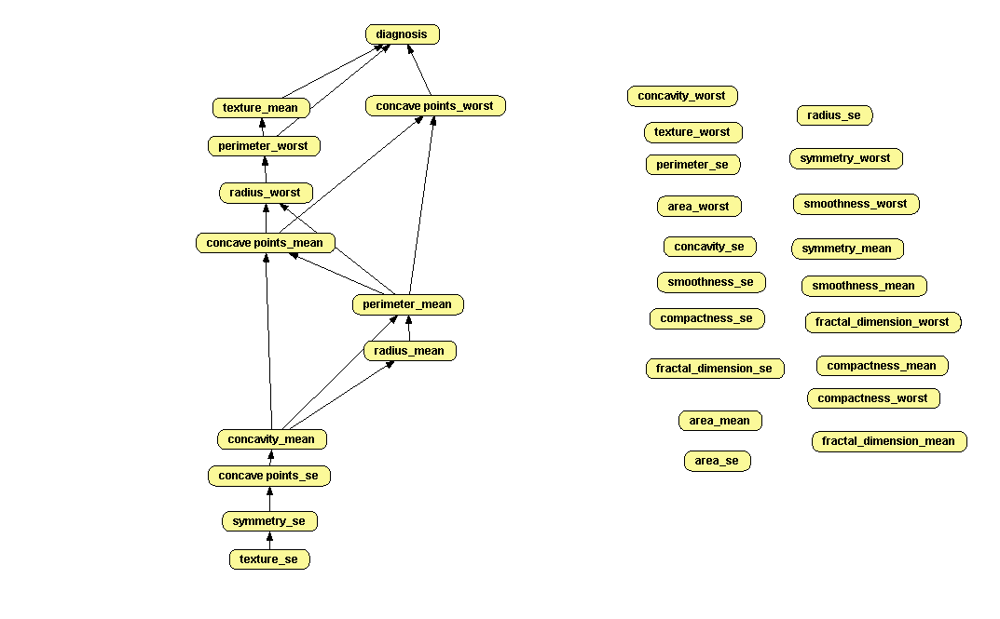

### Data Inspection

Basic data inspection is in the [data_inspection.ipynb](data_inspection.ipynb) notebook.

### Datasets

Original dataset is `data.csv` (from Kaggle, version 2), modified dataset is in the `preprocessed_data.csv`, where one column was removed (see data inspection notebook).

### Open Markov

#### 1) Automatic Training - Hill Climbing Algorithm 
    - Metric: K2 
    - $\alpha$ = 0.5 (Laplace-like correction)
    - Width-equal binning with 3 bins

The model is saved in [models/processed_data_learned_hc.pgmx](models/processed_data_learned_hc.pgmx).

We see that automatic training created a lot of connections. 

What looks suspicious is that `diagnosis` node is a parent for some nodes. In our task of `diagnosis` classification that doesn't make sense. Also it may create cycles, where for classification of the `diagnosis` we need distribution of `diagnosis`. In interactive learning later we will remove such connections.

Also, a lot of connections may imply that our network is overfitted, creating potentially meaningless connections. 

#### 2) Automatic Training - PC Algorithm 
   - Independence test: Cross Entropy
   - significance level: 0.05 
   - $\alpha$ = 0.5 (Laplace-like correction)
   - Width-equal binning with 3 bins

The model is saved in [models/processed_data_learned_pc.pgmx](models/processed_data_learned_pc.pgmx).

Here issues with `diagnosis` as a parent are the same as with the previous model in 1).

The number of connections is very small, and there are a lot of independent components, which do not help to classify `diagnosis`.

#### 3) PC Algorithm (Automatic) and Hill Climbing (Interactive).

To make the network better, we will:
- use nodes from the 1) - automatic hill climbing.
- train automatic PC on those nodes (basically we just maintain structure and dataset preprocessing).
- manually remove meaningless connections from `diagnosis` to other nodes.
- interactively train hill climbing on the current network to add more connections, until metric does not fall below 5 (we solve problem of the 2) that it is not connected enough by adding more connections from the 1))

The model is saved in [models/processed_data_learned_pc.pgmx](models/processed_data_learned_pc.pgmx).

In result, we get following the network, which combines use of both algorithms and some manual adjustments:

Note: we used default hyperparameters for PC algorithm and Hill Climbing (or same as in 1). and 2).).

#### 4) Final Network - Manual Adjustments

In the 3). network we may notice that there are meaningless connection (and potentially meaningless nodes) - for our classification we are interested only in connections and nodes that lead to `diagnosis`.

By manual reduction we get following final model:

The model is saved in [models/processed_data_final.pgmx](models/processed_data_final.pgmx).

The features to the right weren't used to predict the `diagnosis` and may be removed from the dataset.

The model with removed redundant nodes is saved in [models/processed_data_final_reduced.pgmx](models/processed_data_final_reduced.pgmx).

### What to improve:

- the final network is not ideal and it may perform very poorly, because we just follow the numbers and do not use expert knowledge. To improve the network, we can thoroughly study the domain of the dataset and modify network to make connections more meaningful.
- we can try different metrics in Hill Climbing (Entropy, AIC, etc.), or choose the one that suits our needs.
- try different binning - like frequency binning.
- try different amount of bins - binning can lead to major data loss, if used poorly. 
- ideally, we should fine-tune binning method and number of bins for each feature to categorize data in a way that does not lose important information and still computationally feasible for the bayesian network.
