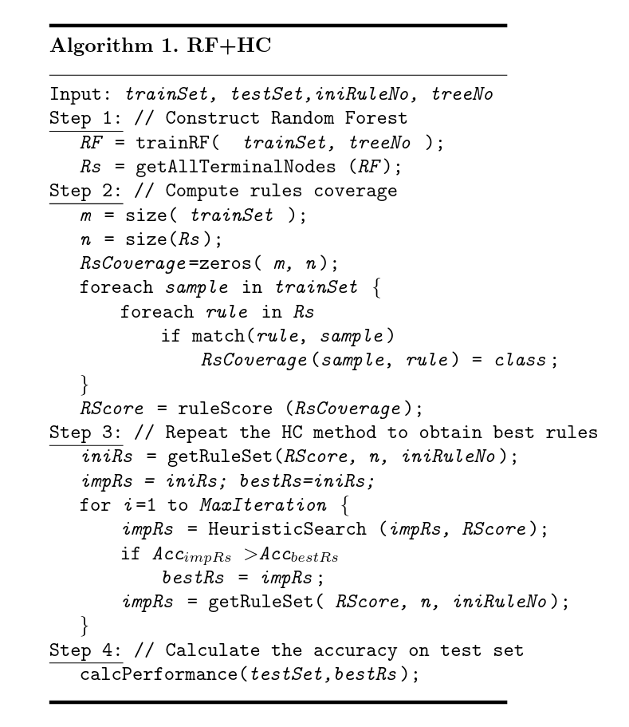

See the [rules_extraction.ipynb](rules_extraction.ipynb), where the task is done and everything is explained.

### Short summary

Random Forest is trained with standard ML approach - tuning hyperparameters and picking the best set of them for the best model.

Example of a tree in a forest:

The tree has a lot of rules (~1000), the following algorithm uses Hill Climbing to extract rules, minimizing the number of rules while keeping comparable performance of the original model:

In the result, we have slightly worse results (97.1% accuracy with RF vs 96.5% accuracy on extracted rules), but reduced the number of rules from ~1000 to only 69.

## The Assignment

## Assignment

Implement an algorithm for extracting rules for a knowledge-based system from decision trees that form a Random Forest (RF) constructed from a dataset.

## Instructions

1. Perform data preprocessing.
2. Construct a Random Forest.
3. Implement the hill climbing algorithm (or a modified variant) to obtain the optimal set of rules.
4. Evaluate the extracted rule set by computing its accuracy on the test dataset.
