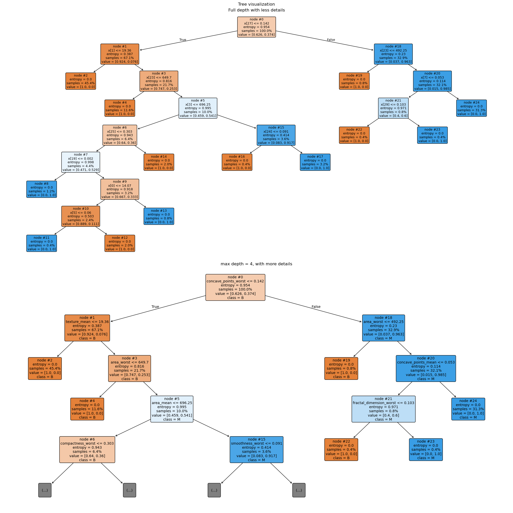

See the [rules_extraction.ipynb](rules_extraction.ipynb), where the task is done and everything is explained.

### Teaser

Random Forest is trained with standard ML approach - tuning hyperparameters and picking the best set of them for the best model.

Example of a tree in a forest:

## The Assignment

## Assignment

Implement an algorithm for extracting rules for a knowledge-based system from decision trees that form a Random Forest (RF) constructed from a dataset.

## Instructions

1. Perform data preprocessing.
2. Construct a Random Forest.
3. Implement the hill climbing algorithm (or a modified variant) to obtain the optimal set of rules.
4. Evaluate the extracted rule set by computing its accuracy on the test dataset.
